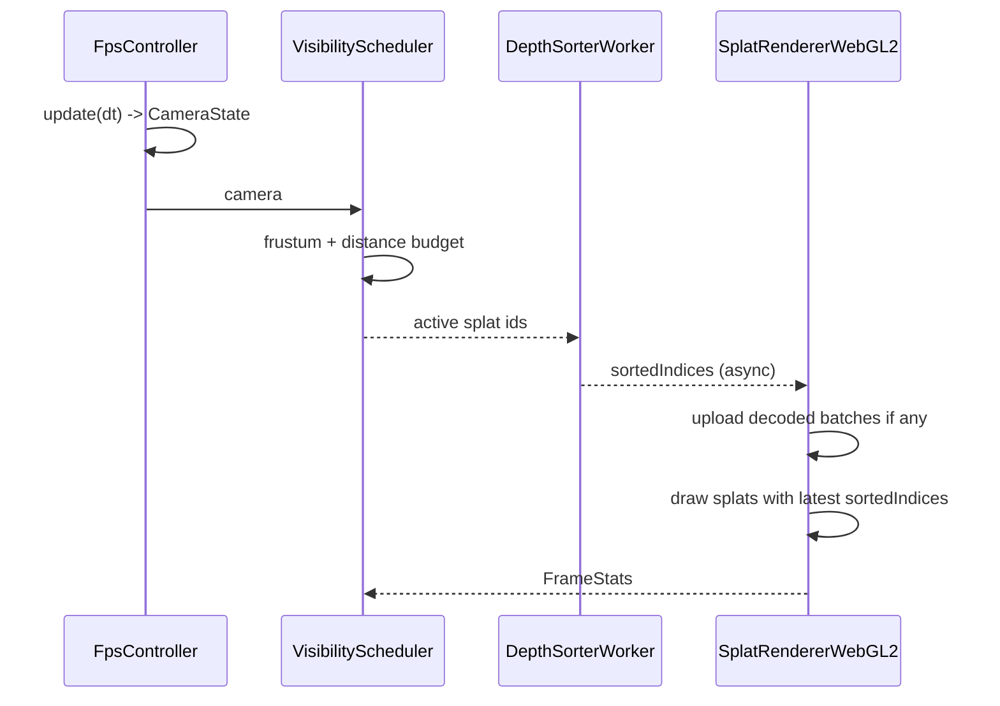

# PlayCanvas 思路增强版架构与开发计划（PLY 直读 / Chrome / WebGL2）

## Summary
- 目标：在 Chrome 桌面端实现可漫游 3DGS 查看器，直接加载 `400w_3jie.ply`，首版使用 SH0，简单第一人称浏览。
- 已锁定关键决策：`纯 WebGL2`、`流式批次解析+分批上传`、`全量 radix 排序`、`单档 balanced`。
- 首版策略对齐：优先对齐 PlayCanvas 的“异步排序 + 预算控制 + 结果复用”；`按批次 Chunk AABB 可见性`降级为优化项（依赖运行时分块）。
- 风险接受：`1080p 60fps` 作为目标，但在“原始 PLY 直读”约束下允许不完全达标。

## 工程搭建与技术栈
### 1) 项目形态
- `Vite + TypeScript` 单页应用（Chrome 桌面优先）。
- 渲染层坚持 `原生 WebGL2`（不引入 Three.js / PlayCanvas runtime）。
- 大文件与重计算走 `Web Worker`（解码 worker、排序 worker）。

### 2) 依赖策略（首版最小化）
- 数学库：`gl-matrix`（仅矩阵/向量计算，避免手写错误）。
- 其余能力使用浏览器原生 API：`fetch + ReadableStream`、`OffscreenCanvas(可选)`、`performance`。
- 不引入状态管理框架；状态由 `CameraStateStore / SceneSetStore / SortStateStore / GpuResidencyStore` 管理。

### 3) 推荐目录
```text
src/
  app/                  # 启动与主循环
  ingest/               # ply header parser + decode scheduler
  workers/              # ply decode worker / depth sort worker
  scene/                # chunk index / visibility / frame budget
  render/               # webgl2 renderer / shaders / gpu pool
  interaction/          # fps controller + input
  stores/               # ssot stores
  debug/                # stats overlay / profiling hooks
```

### 4) 开发与验收命令
- 开发：`npm run dev`（本地 Chrome 调试）。
- 构建：`npm run build`；预览：`npm run preview`。
- 验证：`npm run typecheck` + `npm run lint` + 关键路径手测（加载/漫游/排序回退）。

### 5) 选型理由
- `Vite + TS`：迭代快、worker 与模块拆分友好、类型约束利于复杂数据契约。
- `原生 WebGL2`：满足“纯 WebGL2”约束，保留对 shader/内存/上传节奏的细粒度控制。
- `worker 拆分`：与 PlayCanvas 思路对齐（异步排序、结果复用），避免主线程长阻塞。

## 架构设计（模块拆分 + 数据/状态契约）
### 1) 逻辑分层（正交）
- `Ingest Layer`：`PlyHeaderParser` + `PlyBodyDecoderWorker`，只负责“读/解码/字段提取”。
- `Scene Logic Layer`：`ChunkIndexBuilder` + `VisibilityScheduler` + `FrameBudgetController`，只负责“可见性与预算决策”。
- `Ordering Layer`：`DepthSorterWorker`，只负责“depth key 生成与 radix 排序”。
- `Render Driver Layer`：`GpuBufferPool` + `SplatRendererWebGL2` + `ShaderProgramManager`，只负责“GPU资源与绘制”。
- `Interaction Layer`：`FpsController` + `CameraStateStore`，只负责“输入与相机状态”。

### 2) SSOT（真相来源）
- `CameraStateStore`：相机状态唯一真相源。
- `SceneSetStore`：active chunk/splat 集合唯一真相源。
- `SortStateStore`：当前生效 `sortedIndices` 唯一真相源（双缓冲：front/back）。
- `GpuResidencyStore`：GPU 已上传 chunk 范围与纹理槽位唯一真相源。

### 3) 核心接口（实现前先定）
- `parsePlyHeader(buffer) -> PLYLayout`
- `decodeBatch(payload) -> DecodedBatch`（worker）
- `buildChunkIndex(batchMeta[]) -> ChunkTable`
- `computeVisibleSet(camera, chunkTable, config) -> VisibleSet`
- `sortDepth(activeSplats, camera) -> Uint32Array`（worker）
- `uploadBatch(decodedBatch) -> GpuHandleRange`
- `renderFrame(camera, sortedIndices, gpuRanges) -> FrameStats`
- `updateFpsController(input, dt) -> CameraState`

## 关键模块细化（Shader / 排序 / 数据解析）
### A. 数据解析模块（PLY）
- 输入：binary little-endian PLY。
- 字段提取：仅解码 `x y z scale_0..2 rot_0..3 opacity f_dc_0..2`；跳过 `nx,ny,nz,f_rest_*`（保留 offset，不进入首版运行路径）。
- 批次策略：`batchSize=65536 splats`，维护 `carryBuffer` 处理跨 chunk 半条记录。
- 解码线程：`PlyBodyDecoderWorker`（主线程只做调度与提交）。
- 观测点：
  - `decode_ms_per_batch`
  - `decoded_splats_per_sec`
  - `header_layout_hash`（防偏移错误）

### B. 排序模块（全量 radix）
- 策略：对当帧 `VisibleSet` 执行全量 radix（4-pass, 8-bit/pass）。
- key：camera-space depth（float -> uint sortable key）。
- 触发：相机移动时持续触发；静止超过 `200ms` 停止重排复用前一帧索引。
- 并发：worker 内双缓冲 key/index 数组，避免反复分配。
- 输出：`sortedIndices`（back-to-front）。
- 观测点：
  - `sort_ms`
  - `sorted_count`
  - `sort_stall_frames`（排序结果未就绪导致复用旧索引帧数）

### C. Shader 模块（SH0）
- 顶点着色器：
  - 用 `gl_InstanceID -> sortedIndices -> splatId`
  - 读取属性纹理：`pos/opacity`、`scale/quat`、`sh0`
  - 计算 `Sigma3D = R * diag(scale^2) * R^T`
  - Jacobian 投影到 `Sigma2D`，生成屏幕椭圆 quad
- 片元着色器：
  - 计算 `r2 = p^T * inv(Sigma2D) * p`
  - `alpha = opacity * exp(-0.5*r2)`，`alpha < 1/255` discard
  - color = SH0 RGB（首版）
  - 预乘 alpha 输出 + `SRC_ALPHA, ONE_MINUS_SRC_ALPHA`
- GPU打包：
  - `T0 RGBA32F`: `pos.xyz, opacity`
  - `T1 RGBA16F`: `scale.xyz, quat.x`
  - `T2 RGBA16F`: `quat.yzw, sh0.r`
  - `T3 RGBA16F`: `sh0.g, sh0.b, 0, 0`
- 观测点：
  - `draw_ms`
  - `discard_ratio`
  - `gpu_timer_splat_pass`（若 `EXT_disjoint_timer_query_webgl2` 可用）

### D. 渲染主循环（时序）


## 性能预算与配置（balanced 单档）
- 目标配置（首版固定）：
  - `maxActiveSplats = 900_000`
  - `batchSize = 65_536`
  - `sortTargetInterval = 33ms`（相机运动中尽量每 ~2 帧完成一次全量排序）
  - `devicePixelRatioClamp = 1.0`
- 预算（估算）：
  - GPU属性纹理：约 `40 bytes/splat * activeSplats`
  - `sortedIndices`：`4 bytes * activeSplats`
  - 解码中间缓冲：≤ `3 batch` 常驻
- 瓶颈假设：
  - 第一瓶颈：worker radix 排序时延
  - 第二瓶颈：透明 splat fill-rate
  - 第三瓶颈：批次上传引发的主线程抖动

## 演进式开发计划（由内到外）
### 阶段一：Skeleton（链路打通）
- 完成接口骨架、worker 通讯协议、mock batch 数据渲染单帧。
- 验证：`init -> upload -> draw -> fps camera` 全链路可运行。
- 退出条件：能用 mock 数据稳定渲染并输出基础帧统计。

### 阶段二：Functional Core（拆解执行）
#### 2A 数据链路（真实 PLY 流式解码）
- 目标：接入真实 PLY `header + body` 流式批次解码（先不切换新 shader/排序）。
- 输出：稳定产出 `DecodedBatch` 与批次元信息（总数、偏移、字段映射）。
- 验证：`decode_ms_per_batch`、`decoded_splats_per_sec`、`header_layout_hash` 稳定。

#### 2B 分批上传与驻留
- 目标：打通 `uploadBatch(decodedBatch) -> GpuHandleRange`，落地 `GpuResidencyStore`。
- 输出：真实数据可渲染（先允许使用“原始顺序索引”，视觉可粗糙）。
- 验证：上传吞吐稳定，无持续主线程卡顿；可持续漫游观察场景。

#### 2C 可见性与预算调度（首版）
- 目标：接入 `VisibilityScheduler`，首版以全局预算/距离优先为主，保留 chunk 接口。
- 输出：`activeSplats` 随相机变化，预算可控。
- 验证：相机移动时 `active_splats` 与帧耗时曲线符合预期，无明显抖动。

#### 2D 全量 radix 排序 worker
- 目标：对当帧 `VisibleSet` 做 4-pass radix；接入前后缓冲索引复用。
- 输出：运动中持续更新排序，静止超过 `200ms` 复用结果。
- 验证：`sort_ms`、`sorted_count`、`sort_stall_frames` 达到可用阈值。

#### 2E SH0 椭圆 splat shader
- 目标：完成 `Sigma3D -> Sigma2D` 投影、椭圆高斯与 back-to-front 混合。
- 输出：替换阶段一 mock 点渲染路径，形成首版视觉正确性基线。
- 验证：固定机位截图回归通过；快速转向时伪影可恢复且无明显穿插错误。

### 阶段二状态追踪（开发完成/验收完成）
- 维护规则：每次“开发完成”或“验收完成”后，必须同步更新本节状态与日期。
- 最后更新时间：2026-04-22

| 子项 | 开发完成 | 验收完成 | 备注 |
| --- | --- | --- | --- |
| 2A 数据链路（真实 PLY 流式解码） | [x] | [ ] | `useRealPly` 与 ingest 指标链路已接入；需补解析正确性验收记录 |
| 2B 分批上传与驻留 | [x] | [ ] | 主链路已打通；需补性能采样结论（吞吐/卡顿） |
| 2C 可见性与预算调度（首版） | [x] | [ ] | `VisibilityScheduler` 与预算开关已接入；需补抖动/曲线验收结论 |
| 2D 全量 radix 排序 worker | [x] | [ ] | worker 4-pass radix 已接入；需补阈值验收（`sort_ms`/`sorted_count`/`sort_stall_frames`） |
| 2E SH0 椭圆 splat shader | [x] | [ ] | 已接入 `scale/quat -> Sigma3D -> Sigma2D` 投影与椭圆高斯路径；需补固定机位截图回归 |

### 阶段三：Robustness & Optimization（稳健与调优）
- 加入上传节流、排序超时回退（复用旧索引）、错误恢复（worker重启/丢包重试）。
- 引入运行时分块（chunk/tile）与 Chunk AABB 可见性裁剪，降低排序与绘制压力。
- 增加性能观测面板与 profiling 开关。
- 针对 1080p 调整 `maxActiveSplats` 与排序节流，收敛 balanced 参数。
- 验证：3分钟连续漫游稳定，无长卡死；输出性能报告。

### 阶段二并行开发与验证策略
- 原则：`并行开发，串行集成`。各子项可并行实现，但主分支按 `2A -> 2B -> 2C -> 2D -> 2E` 顺序合入。
- 可并行组：
  - 组1：`2A`（解码）与 `2E`（shader 数学原型）可并行；通过 mock 输入先验证 shader 数学正确性。
  - 组2：`2B`（上传驻留）与 `2D`（radix worker）可并行；以统一的 `splatId/index` 契约对接。
  - 组3：`2C`（可见性预算）可与 `2D` 并行，前提是 `VisibleSet` 数据结构先冻结。
- 集成门禁（每次合并必须满足）：
  - 类型与静态检查：`npm run typecheck`、`npm run lint` 通过。
  - 行为回归：保留 `feature flags`（`useRealPly`、`useRadixSort`、`useEllipseShader`、`useVisibilityBudget`），任一关闭时可回退到已知稳定路径。
  - 性能采样：至少记录 `avg/p95 fps`、`sort_ms`、`upload_ms`、`draw_ms`、`active_splats` 五项。

## Test Plan
- 解析正确性：
  - header 偏移/stride 单测
  - 随机抽样 1k splat 与 Python 参考解码结果比对
- 渲染正确性：
  - 固定相机截图回归（alpha混合顺序）
  - 快速转向场景下伪影与恢复时间统计
- 并发稳定性：
  - worker 重启/超时注入测试
  - 上传与排序并发下无主线程阻塞 > 200ms
- 性能验收：
  - 1080p、Chrome：记录 `avg/p95 fps`, `sort_ms`, `draw_ms`, `upload_ms`, `active_splats`
  - 结论以 `balanced` 单档为准

## Assumptions
- 不做离线压缩与格式转换；仅支持原始 PLY 输入。
- 首版不启用高阶 SH 与碰撞系统。
- 原始 PLY 虽是单体文件，仍可在运行时按批次/空间键重建分块并做裁剪；该能力放入优化阶段而非首版阻塞项。
- 若 60fps 未达标，优先调 `maxActiveSplats` 与排序节流参数，不改架构分层。
